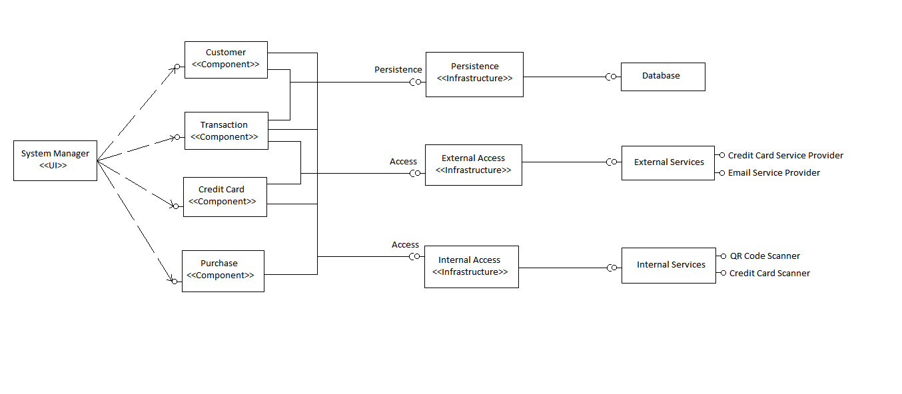
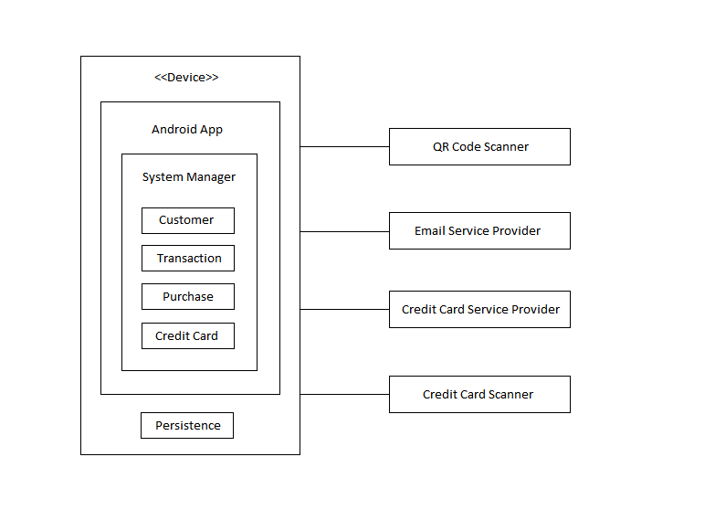
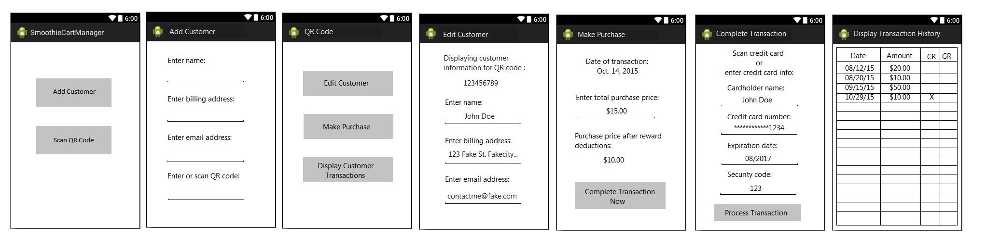
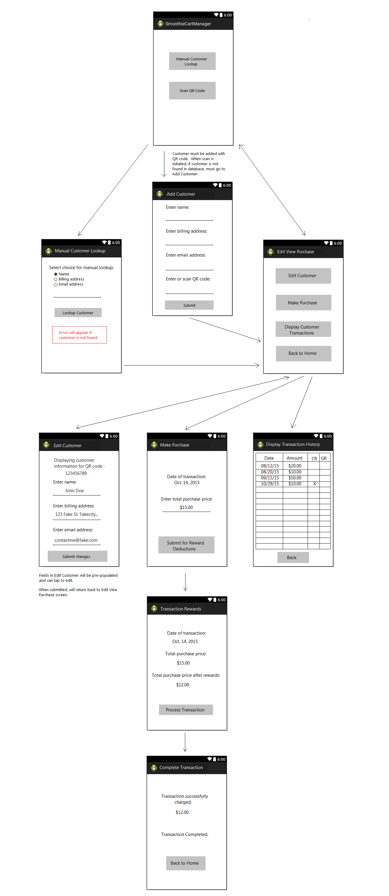
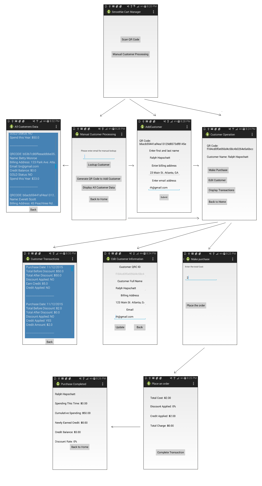

# Design Document

**Author**: Team24 - Yongchang Ma, Kirk Pastorian, Monica Maslowski and Fatima Riaz

## 1 Design Considerations

### 1.1 Assumptions

The stakeholders of a smoothie cart business are looking for a payment and rewards management system for smoothie carts.  This system's functionality provides for (a) addition of new customer details, QR-codes, and credit card information  (b) editing existing customer information, (c) calculating customer purchase costs including applying earned credits and discounts, (d) processing smoothie cart purchases via credit card transactions, (e) providing customer transaction histories and (f) sending email notifications for customer-earned rewards.  The system interacts with credit card scanning services, QR code scanning services, email services for customer notifications, and provides persistent storage of customer data.

Significant issues may arise during implementation if there are errors in the design as this will lead to reworking of the design as well as reworking of the possibly already implemented code.  Since this project also deals with several external libraries and functionalities outside the system itself, there are some initial assumptions that have to be made with these aspects.  The persistent storage requirements as well as the credit card, QR-code, and email inputs will be assumed by the team initially until further constraints are provided.  Credit card and QR inputs will be based on manually entry for the initial implementation.

### 1.2 Constraints

The main constraints on the system that have a significant impact on the design of the system lie with the persistent data storage, the email service provider for sending emails to customers, as well as the QR code and credit card scanners.  There are many options for persistent storage for android mobile devices, and each option potentially will require slightly different design considerations.  Cloud, internal device, database, and flat file storage options are some of the different ways the team can store data persistently.  To provide ease of use and data integrity a SQL-lite database will be considered for initial implementation.  The QR and credit card scanner inputs also have not been significantly detailed and implementation will be based on provided libraries / inputs into the system.  Scanner input may realistically have to be input through the Smoothie Cart system versus through an actual scanning device.  This also may impact the design, code, and interactions of the system.  

### 1.3 System Environment

Smoothie Cart Manager is a software application that will be implemented on the Android mobile operating system.  The target API for this application is 19 and will be compatible with APIs 9-23.  Testing will be performed on a virtual Android device -- Google Nexus 4 4.4.4 API-19 operating through a Genymotion virtual device manager.  

The system will interact with a data storage system and the interactions will depend further on the exact option the team decides is the best fit.  The team evaluated SQLite as the persistent storage as this is a suitable database for Android devices.  The scanning systems for credit cards and QR codes have not been detailed in the requirements and can be assumed initially as direct inputs into the system.  The email function of the software will also have to interact with some external email provider or may be assumed to be formatted strictly as a file at this time.

*Update* - The team has been supplied with a library containing utilities provided as a jar file containing the QR code scanning, credit card reading, transaction processing, and email sending functions.  The external interactions on these functions have now been consolidated to this library.

## 2 Architectural Design

### 2.1 Component Diagram

The component diagram starts with the System Manager which is the user interface.  The user interface invokes four different components: customer, transaction, purchase, and credit card.  The customer and transaction components both need to store information permanently in the form of persistent storage.  The transaction and credit card components require access to external services like the credit card and email service providers.  The customer, transaction, purchase, and credit card components use an internal access in the form of either a QR scanner or a credit card scanner.  These are indicated as internal access as the QR or credit card scanner are assumed to be separate applications or attachments on the mobile device.

### 2.2 Deployment Diagram

The deployment diagram shows that the mobile device (with specifications described earlier) will have the android app installed.  The system manager interface will incorporate the customer, transaction, purchase, and credit card components.  The device will also include the persistence storage such as a database or internal storage on the device.  The credit card and email service providers are outside providers that will have to communicate with the application externally.  The QR and credit card scanners are assumed to be devices attached to the mobile device as displayed on the diagram. 

## 3 Low-Level Design

The main components of the system itself are the customer, purchase, transaction, and credit card components that are to be implemented as separate classes.  These components must be able to interact with each other as well as other external/internal components of the device itself.  The UML class diagram below will further detail the attributes and methods of the outlined classes.

*Update* - Upon receiving the supplied library containing a set of utilities provided as a jar file, the credit card class is no longer needed.  The jar file returns all the necessary credit card information and so the information will no longer need to be assumed as manually input and temporarily stored in the system for processing.   

### 3.1 Class Diagram

## 4 User Interface Design

####Updated Mock-up Screens:

####Actual Release Screens:

