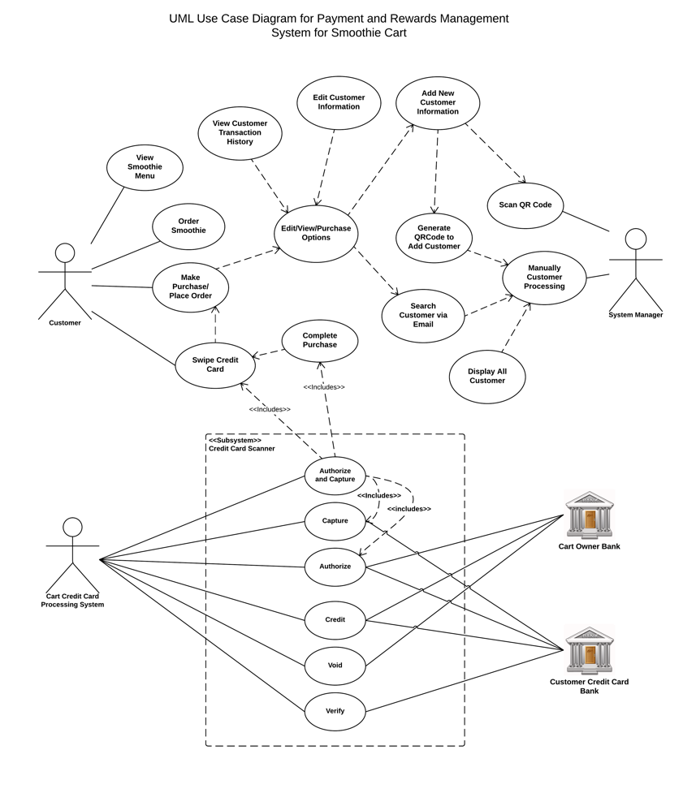

# Use Case Model

Author: Team24 - Yongchang Ma, Kirk Pastorian, Monica Maslowski and Fatima Riaz

### 1 Use Case Diagram

### 2 Use Case Descriptions

###Actor: Customer

###Use Cases

####View Smoothies Menu

<table width ="100%" border cellspacing ="0" cellpadding ="0">
<th width="20%">Use Case #1</th>
<th>View Smoothies Menu</th>

<tr align = "left">
<td><b>Requirements</b></td>
<td>Browse catalog to find items of interest</td>
</tr>

<tr align = "left">
<td><b>Pre-conditions</b></td>
<td>Customer Present at Smoothie Cart</td>
</tr>

<tr align = "left">
<td><b>Flow of Events</b></td>
<td>Customer can look for items they wish to purchase, or simply browse through different categories and look at all Smoothies offered.</td>
</tr>

<tr align = "left">
<td><b>Basic Flow</b></td>
<td>Go through products listed on Cart Menu</td>
</tr>

<tr align = "left">
<td><b>Alternative Flows</b></td>
<td>1. May be nothing the Customer likes.        
 2. Items they want may be out of stock.        
 3. May not be able to reach the Smoothie Cart.</td>
</tr>

<tr align = "left">
<td><b>Post Conditions</b></td>
<td>Look at different items and find something the Customer likes</td>
</tr>
</table>

####Order Smoothie

<table width ="100%" border cellspacing ="0" cellpadding ="0">
<th width="20%">Use Case # 2</th>
<th>Order Smoothie</th>

<tr align = "left">
<td><b>Requirements</b></td>
<td>Customer Request for the Smoothie after Deciding from Menu</td>
</tr>

<tr align = "left">
<td><b>Pre-conditions</b></td>
<td>Customer Should Decide What he/She wants to Order</td>
</tr>

<tr align = "left">
<td><b>Flow of Events</b></td>
<td>Customer viewed the products from the menu and decided which type of smoothie he/she wants to order and how many in quantiy.</td>
</tr>

<tr align = "left">
<td><b>Basic Flow</b></td>
<td>Requesting Cart owner for the Smoothie.</td>
</tr>

<tr align = "left">
<td><b>Alternative Flows</b></td>
<td>1. May Product out of stock Customer likes.        
 2. There may be lot people in the line.        
 3. May not be able to wait for order.</td>
</tr>

<tr align = "left">
<td><b>Post Conditions</b></td>
<td>Placed Ordered for the Desired Smoothie.</td>
</tr>
</table>

####Place Order/Make Purchase

<table width ="100%" border cellspacing ="0" cellpadding ="0">
<th width="20%">Use Case # 3</th>
<th>Place Order/Make Purchase</th>

<tr align = "left">
<td><b>Requirements</b></td>
<td>Customer Place the Final Order</td>
</tr>

<tr align = "left">
<td><b>Pre-conditions</b></td>
<td>Use Case: "Order Smoothie"</td>
</tr>

<tr align = "left">
<td><b>Flow of Events</b></td>
<td>1.Customer Review the Order.
 2.Customer Approve the Final Order Amount.</td>
</tr>

<tr align = "left">
<td><b>Basic Flow</b></td>
<td>Customer will Finalize the Order Amount.</td>
</tr>

<tr align = "left">
<td><b>Alternative Flows</b></td>
<td>1. Customer might Cancel the Order.        
 2. Customer might Remove item from the Order.        
 3. Customer might leave without finalizing Order.</td>
</tr>

<tr align = "left">
<td><b>Post Conditions</b></td>
<td>Customer Will be ready for Checkout.</td>
</tr>
</table>

####Swipe Credit Card

<table width ="100%" border cellspacing ="0" cellpadding ="0">
<th width="20%">Use Case # 4</th>
<th>Swipe Credit Card</th>

<tr align = "left">
<td><b>Requirements</b></td>
<td>Customer Swipes Credit card at Checkout</td>
</tr>

<tr align = "left">
<td><b>Pre-conditions</b></td>
<td>Use Case: "Charge Card/Complete Purchase"</td>
</tr>

<tr align = "left">
<td><b>Flow of Events</b></td>
<td>1.Customer Swipes Credit Card from the Credit Card Machine.
 2.Customer Press OK to complete the Checkout Process.
 3.Customer waits for the receipt of the transaction.
 4.Cart Manager Hand over the Customer Copy of the receipt.</td>
</tr>

<tr align = "left">
<td><b>Basic Flow</b></td>
<td>Customer will Finalize Checkout Process but swiping the Credit Card</td>
</tr>

<tr align = "left">
<td><b>Alternative Flows</b></td>
<td>1. Customer might Cancel the Transaction.        
 2. Transaction taking too long to complete.
 3. Transaction Denied from the bank.
 4. Credit card Service provider System down and unable to process the Transaction.       
</td>
</tr>

<tr align = "left">
<td><b>Post Conditions</b></td>
<td>Customer will be given the Checkout Receipt for his/her Order.</td>
</tr>
</table>

###Actor: System Manager

###Use Cases

####Scan Customer QR Card

<table width ="100%" border cellspacing ="0" cellpadding ="0">
<th width="20%">Use Case # 5</th>
<th>Scan Customer QR Card</th>

<tr align = "left">
<td><b>Requirements</b></td>
<td>System manager scan the customer QR card to  Process Customer Information.</td>
</tr>

<tr align = "left">
<td><b>Pre-conditions</b></td>
<td>System Must be initiated and System Manager Starts the app by tapping on it.</td>
</tr>

<tr align = "left">
<td><b>Flow of Events</b></td>
<td>1.System Manager Initiate the App by clicking or Tapping the App Icon on Android System.
 2.System Manager Select the Scan QR Card Menu from the App Interface to Enter the Customer Information.
</td>
</tr>

<tr align = "left">
<td><b>Basic Flow</b></td>
<td>Scan Customer QR Card.</td>
</tr>

<tr align = "left">
<td><b>Alternative Flows</b></td>
<td>1. App Taking too long to Open.        
 2. Scan Customer QR Code Menu taking too long to Open.
 3. App is not Responding.    
</td>
</tr>

<tr align = "left">
<td><b>Post Conditions</b></td>
<td>"Add Customer" or "Edit View Purchase" Menu will be Displayed to the System Manager.</td>
</tr>
</table>

####Add New Customer

<table style="width:100%"  border cellspacing ="0" cellpadding ="0">
<th width="20%">Use Case # 6</th>
<th>Add New Customer</th>

<tr align = "left">
<td><b>Requirements</b></td>
<td>After scanning the QR Card if customer information does not exist "Add New Customer" Form will be displayed to the customer to Enter the New Customer Information.</td>
</tr>

<tr align = "left">
<td><b>Pre-conditions</b></td>
<td>Use Case: "Scan Customer QR Card" OR
    Use Case: "Generate QR Code to Add Customer".
</td>
</tr>

<tr align = "left">
<td><b>Flow of Events</b></td>
<td>1.Add new Customer form will be displayed to the customer after scanning the card.
 2.System Manager Ask Customer to Provide following Information. &nbsp;&nbsp;&nbsp;&nbsp;&nbsp;&nbsp;#Customer Name &nbsp;&nbsp;&nbsp;&nbsp;&nbsp;&nbsp;#Billing
Address &nbsp;&nbsp;&nbsp;&nbsp;&nbsp;&nbsp;#Email address.
 3. System Manager Enter the Information In the Appropriate Fields of "Add new Customer" Form.
 4.System Manager Press "Add" or "Save" button to Add New Customer Information.
 5.Confirmation Message is Displayed to the System Manager that Values has been saved.
</td>
</tr>

<tr align = "left">
<td><b>Basic Flow</b></td>
<td>Adding New Customer Information to the System.</td>
</tr>

<tr align = "left">
<td><b>Alternative Flows</b></td>
<td>1. System Manager Unable to Open Option "Add New Customer Information" from Menu "Process Customer Information".        
 2. Customer Denies to Provide Required Information.
 3. System Unable to Save Customer Information.   
</td>
</tr>

<tr align = "left">
<td><b>Post Conditions</b></td>
<td>New Customer Information Added to the System.</td>
</tr>
</table>

####Edit/View/Purchase Options

<table width ="100%" border cellspacing ="0" cellpadding ="0">
<th width="20%">Use Case # 7</th>
<th>Edit/View/Purchase Options</th>

<tr align = "left">
<td><b>Requirements</b></td>
<td>System manager Selects the Option "Edit/View/Purchase Options" .</td>
</tr>

<tr align = "left">
<td><b>Pre-conditions</b></td>
<td>Use Cases: "Add New Customer" OR
            "Search Customer Via Email"</td>
</tr>

<tr align = "left">
<td><b>Flow of Events</b></td>
<td>1. Edit/View/Purchase form will be displayed to the System manager after adding new Customer of searching customer via email.
</td>
</tr>

<tr align = "left">
<td><b>Basic Flow</b></td>
<td>Display of "Edit/View/Purchase Options" Menu Screen.</td>
</tr>

<tr align = "left">
<td><b>Alternative Flows</b></td>
<td>1. App Taking too long to Open.        
 2.  Menu taking too long to Open.
 3. App is not Responding.    
</td>
</tr>

<tr align = "left">
<td><b>Post Conditions</b></td>
<td>"Edit/View/Purchase Options" Screen will be Displayed to the System Manager.</td>
</tr>
</table>

####Edit Customer Information

<table width ="100%" border cellspacing ="0" cellpadding ="0">
<th width="20%">Use Case # 8</th>
<th>Edit Customer Information</th>

<tr align = "left">
<td><b>Requirements</b></td>
<td>"Edit Customer Information" form will be displayed to System Manager to Edit the Information. </td>
</tr>

<tr align = "left">
<td><b>Pre-conditions</b></td>
<td>Use Case: "Edit/View/Purchase Options"
</tr>

<tr align = "left">
<td><b>Flow of Events</b></td>
<td>1. System Manager Selects the Option Edit Customer Information Menu from the "Edit/View/Purchase Screen".
 2. Edit Customer Information Form will be displayed to the Customer.
 3. System Manager inquire about the Changes from Customer.
 4. Edit the given information.
 5. Press Save button to save the Edited information.
</td>
</tr>

<tr align = "left">
<td><b>Basic Flow</b></td>
<td>Edit Customer Information</td>
</tr>

<tr align = "left">
<td><b>Alternative Flows</b></td>
<td>1. Scanner did not read the Card.        
 2. System Manager Unable to Open Option "Edit Customer Information" from Menu.
 3. Error Generated while Scanning Card.
 4. System Unable to find any information against that ID Card.
 5. Customer Denies to Provide Required Information. 
</td>
</tr>

<tr align = "left">
<td><b>Post Conditions</b></td>
<td>Customer Information is Updated in the System.</td>
</tr>
</table>

####View Customer Transactions

<table width ="100%" border cellspacing ="0" cellpadding ="0">
<th width="20%">Use Case # 9 </th>
<th>View Customer Transaction History
</th>

<tr align = "left">
<td><b>Requirements</b></td>
<td>"View Customer Transactions" Form will be displayed to the System Manager to View all the Transactions. </td>
</tr>

<tr align = "left">
<td><b>Pre-conditions</b></td>
<td>Use Case: ""Edit/View/Purchase Options""
</tr>

<tr align = "left">
<td><b>Flow of Events</b></td>
<td>1.System Manager selects the "view Customer Transactions" option from the app.
 2. System Search for Transaction History against that Customer ID.
 3. System Display Customer Transaction History in a GridView.
</td>
</tr>

<tr align = "left">
<td><b>Basic Flow</b></td>
<td>System Manager View Customer Transaction History</td>
</tr>

<tr align = "left">
<td><b>Alternative Flows</b></td>
<td>1. System did not find any History against that Customer Name or ID.        
 2. System Manager Unable to Open Option "View Customer Transactions" from Menu.
 3. Error Generated while Searching Customer ID or Name. 
</td>
</tr>

<tr align = "left">
<td><b>Post Conditions</b></td>
<td>Customer Transaction History is Displayed to the System Manager.</td>
</tr>
</table>

####Place Order/Make Purchase

<table width ="100%" border cellspacing ="0" cellpadding ="0">
<th width="20%">Use Case # 10</th>
<th>Place Order/Make Purchase</th>

<tr align = "left">
<td><b>Requirements</b></td>
<td>System Manager Prepare and Enter the Final Order Order Amount at Make Purchase Screen</td>
</tr>

<tr align = "left">
<td><b>Pre-conditions</b></td>
<td>Use Case: ""Edit/View/Purchase Options""</td>
</tr>

<tr align = "left">
<td><b>Flow of Events</b></td>
<td>1.System Manager Calculate the Sub-Total of the Order.
 2. System Manager Press the Place Order Button on the form.
 3. Place an Order Screen will be displayed to the System Manager with automatic calculation of Total Order After Applying Discounts or Credit if Customer is eligible.
 5. System Manager request customer to have finalize the Charge Amount.
 6. System Manager Request Customer to Swipe Credit Card.
</td>
</tr>

<tr align = "left">
<td><b>Basic Flow</b></td>
<td>System Manager Scan the Customer ID Card and select process order and Enter the Order Total to the System.</td>
</tr>

<tr align = "left">
<td><b>Alternative Flows</b></td>
<td>1. Customer might Cancel the Order.        
 2. Customer might Remove item from the Order.        
 3. Customer might leave without finalizing Order.
 4. System Manager Fails to Apply Discount or Credit.</td>
</tr>

<tr align = "left">
<td><b>Post Conditions</b></td>
<td>Customer Will be ready to swipe Credit Card.</td>
</tr>
</table>

####Complete Purchase

<table width ="100%" border cellspacing ="0" cellpadding ="0">
<th width="20%">Use Case # 11</th>
<th>Charge Card/Complete Purchase</th>

<tr align = "left">
<td><b>Requirements</b></td>
<td>System Manager Selects Check out Option on the System.</td>
</tr>

<tr align = "left">
<td><b>Pre-conditions</b></td>
<td>Use Case: "Place Order/Make Purchase"</td>
</tr>

<tr align = "left">
<td><b>Flow of Events</b></td>
<td>1. Complete Purchase Form will be displayed to the System Manager.
 2. Form will Display Sub-Total,Discounts if illegible and Total Order Amount. 
 3. System Manager waits for the customer to swipe their Credit card.
 4. System Manager Approve the Transaction.
 5. System Manager wait for the printer to print the receipt.
 6. System Manager handover the receipt to the Customer.
</td>
</tr>

<tr align = "left">
<td><b>Basic Flow</b></td>
<td>System Manager Help Customer to Checkout the Order.</td>
</tr>

<tr align = "left">
<td><b>Alternative Flows</b></td>
<td>1. Customer might Cancel the Order.                
 2. Customer might leave without finalizing Order.
 3. Credit Card Denies from the Bank.
 4. Credit Card Machine Unable to Read Customer Information.
 5. Printer is Unable to print receipt.</td>
</tr>

<tr align = "left">
<td><b>Post Conditions</b></td>
<td>Customer is Checked out.</td>
</tr>
</table> 

####Manual Customer Processing

<table width ="100%" border cellspacing ="0" cellpadding ="0">
<th width="20%">Use Case # 12</th>
<th>Manual Customer Processing</th>

<tr align = "left">
<td><b>Requirements</b></td>
<td>System Manager Selects "Manual Customer Processing" Option on the System.</td>
</tr>

<tr align = "left">
<td><b>Pre-conditions</b></td>
<td>System Must be initiated and System Manager Starts the app by tapping on it.</td>
</tr>

<tr align = "left">
<td><b>Flow of Events</b></td>
<td>1.System Manager Initiate the App by clicking or Tapping the App Icon on Android System.
 2.System Manager Select the "Manual Customer Processing" option from the App Interface to Process the Customer Information.
</td>
</tr>

<tr align = "left">
<td><b>Basic Flow</b></td>
<td>press generate QR code button to submit Manual QR Code to the system.</td>
</tr>

<tr align = "left">
<td><b>Alternative Flows</b></td>
<td>1. App Taking too long to Open.        
 2. "Manual Customer Processing" Menu taking too long to Open.
 3. App is not Responding.    
</td>
</tr>

<tr align = "left">
<td><b>Post Conditions</b></td>
<td>"Generate QRCode to Add Customer/Enter Email to manual Look up/Display All Customer" Options will be Displayed to the System Manager.</td>
</tr>
</table>

####Search Customer via Email

<table width ="100%" border cellspacing ="0" cellpadding ="0">
<th width="20%">Use Case # 13</th>
<th>Search Customer via Email</th>

<tr align = "left">
<td><b>Requirements</b></td>
<td>System manager will Process the Customer Information via Customer Email.</td>
</tr>

<tr align = "left">
<td><b>Pre-conditions</b></td>
<td>Use Case:"Manual Customer Processing"</td>
</tr>

<tr align = "left">
<td><b>Flow of Events</b></td>
<td>1.System Manager will Enter Customer Email Address into the TextField.
 2.System will the search the customer against This Email Address.
 3.if Customer information exist in the database then customer processing options will be displayed to the System Manager.
 4.if Customer information does not exist then a message will be displayed to the System Manager "Data Not Found".
</td>
</tr>

<tr align = "left">
<td><b>Basic Flow</b></td>
<td>Search for customer Via Email Address. </td>
</tr>

<tr align = "left">
<td><b>Alternative Flows</b></td>
<td>1. App Taking too long to Open.        
 2. "Manually Process Customer Information" Menu taking too long to Open.
 3. App is not Responding. 
 4. Customer information does not exists.   
</td>
</tr>

<tr align = "left">
<td><b>Post Conditions</b></td>
<td>"Edit View Purchase" options will be displayed to the System Manager if customer information exits against that Email Id.</td>
</tr>
</table>

####Display All Customers

<table width ="100%" border cellspacing ="0" cellpadding ="0">
<th width="20%">Use Case # 14</th>
<th>View All Customer</th>

<tr align = "left">
<td><b>Requirements</b></td>
<td>System manager View All Customer Data.</td>
</tr>

<tr align = "left">
<td><b>Pre-conditions</b></td>
<td>Use Case:"Manual Customer Processing"</td>
</tr>

<tr align = "left">
<td><b>Flow of Events</b></td>
<td>1.System Manager will press the Button "Display All Customers".
 2.System will the search the all the customers.
 3.if Customers information exist in the database then all customer Information will be displayed to the System Manager.
 4.if Customer information does not exist then a message will be displayed to the System Manager "Data Not Found".
</td>
</tr>

<tr align = "left">
<td><b>Basic Flow</b></td>
<td> Display All Customer Data. </td>
</tr>

<tr align = "left">
<td><b>Alternative Flows</b></td>
<td>1. App Taking too long to Open.        
 2. "View All" Button is not working.
 3. App is not Responding. 
 4. Customer information does not exists.   
</td>
</tr>

<tr align = "left">
<td><b>Post Conditions</b></td>
<td>"Edit View Purchase" options will be displayed to the System Manager if customer information exits against that Email Id.</td>
</tr>
</table>

####Generate QRCode to Add Customer

<table width ="100%" border cellspacing ="0" cellpadding ="0">
<th width="20%">Use Case # 15</th>
<th>Generate QRCode to Add Customer</th>

<tr align = "left">
<td><b>Requirements</b></td>
<td>System manager press or tap the Generate QRCode button to Add New Customer.</td>
</tr>

<tr align = "left">
<td><b>Pre-conditions</b></td>
<td>Use Case:"Manual Customer Processing"</td>
</tr>

<tr align = "left">
<td><b>Flow of Events</b></td>
<td>1.System Manager will press or tap the Button "Generate QRCode to Add Customer".
 2.System will auto generates the QRCode for Adding New Customer Information and display on the "Add New Customer" Form.
 3.System Manager inputs the Data about the New Customer into the Fields.
 4.System Manager press the submit button to save the Data into the Database about the New Customer.
</td>
</tr>

<tr align = "left">
<td><b>Basic Flow</b></td>
<td> Add New Customer Manually using option "Generate QRCode to Add Customer " Option. </td>
</tr>

<tr align = "left">
<td><b>Alternative Flows</b></td>
<td>1. App Taking too long to Open.        
 2. "Generate QRCode to Add Customer" Button is not working.
 3. App is not Responding.    
</td>
</tr>

<tr align = "left">
<td><b>Post Conditions</b></td>
<td>"Edit/View/Purchase" options will be displayed to the System Manager After Adding new customer to the database.</td>
</tr>
</table>

###Actor: Cart Credit Card Processing System.

The Cart Manager submits credit card transaction requests to the credit card payment gateway on behalf of a customer. Bank which issued customer's credit card is actor which could approve or reject the transaction. If transaction is approved, funds will be transferred to merchant's bank account.

####Use Case:Authorize and Capture
**Summary**: use case is the most common type of credit card transaction. The requested amount of money should be first authorized by Customer's Credit Card Bank, and if approved, is further submitted for settlement. During the settlement funds approved for the credit card transaction are deposited into the Merchant's Bank account.
In some cases, only authorization is requested and the transaction will not be sent for settlement. In this case, usually if no further action is taken within some number of days, the authorization expires. Merchants can submit this request if they want to verify the availability of funds on the customer’s credit card, if item is not currently in stock, or if merchant wants to review orders before shipping.
Capture (request to capture funds that were previously authorized) use case describes several scenarios when merchant needs to complete some previously authorized transaction - either submitted through the payment gateway or requested without using the system, e.g. using voice authorization.

####Use Case: Credit

**Summary**: Credit use case describes situations when customer should receive a refund for a transaction that was either successfully processed and settled through the system or for some transaction that was not originally submitted through the payment gateway. 

####Use Case: Void

**Summary**: Void use case describes cases when it is needed to cancel one or several related transactions that were not yet settled. If possible, the transactions will not be sent for settlement. If the Void transaction fails, the original transaction is likely already settled.

####Use Case: Verify

**Summary**: Verify use case describes zero or small amount verification transactions which could also include verification of some client's data such as address.