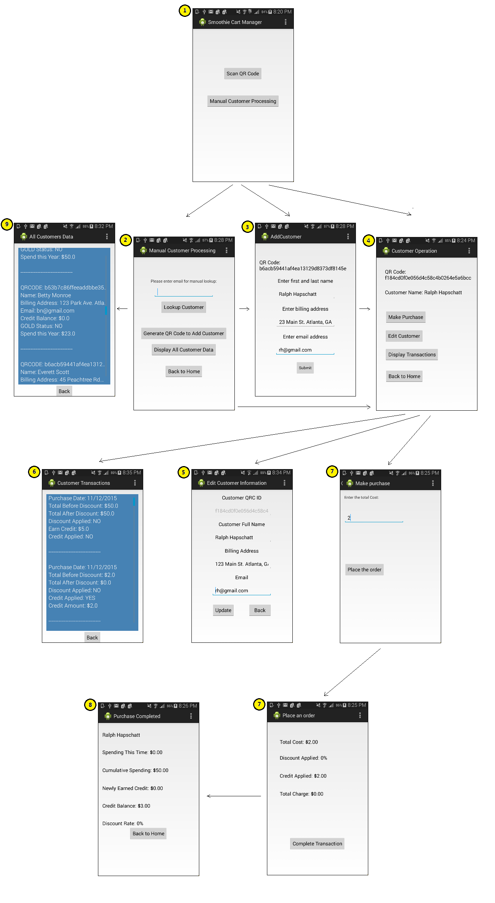

# **User Manual - Smoothie Cart Manager App**

Author: Team24 - Yongchang Ma, Kirk Pastorian, Monica Maslowski and Fatima Riaz

## Synopsis

   This user manual is to help the user understand and to be able to navigate and use the Smoothie Cart Manager App.  The Smoothie Cart Manager App is designed to allow the user to add customers, edit customer information, process purchases by credit card, and to keep track of customers purchases and rewards.  Emails will also be sent automatically to the customer updating earned rewards.

## Description

   Smoothie Cart Manager app is designed to operate on android mobile devices and is compatible with API levels 9-23.
    
### Smoothie Cart Manager App Main Functionality and Screen Overview
    
   1. Smoothie Cart Manager (Home Screen) - Allows for QR code scanning or manual customer processing.
   2. Manual Customer Processing Screen - If customer card is not available for scanning, the customer may be looked up with their previously entered email address (unique identifier).  This page allows for viewing all customers and generating QR codes for new customers without scanning. 
   3. Add Customer Screen - Detects whether a QR code has not been entered into the system and prompts to add the customer information.
   4. Customer Operation Screen - This screen is where existing customer functionality can be chosen.  The manager has the options to edit the customer information, make a purchase for the customer, or view the customers prior transactions.
   5. Edit Customer Information Screen - Existing customer information is loaded on the screen and can be updated and saved.
   6. Customer Transactions Screen - This screen allows for the viewing of all transactions for the customer with information containing: date, purchase price before rewards, transaction amount after rewards, and which rewards were applied/awarded.
   7. Make Purchase/Place an Order Screen - First the total purchase price is entered.  Next, the app will determine whether the customer has earned any rewards that can be deducted from the total purchase price.  The new purchase price will be ready for the credit card transaction.  This screen will allow for swiping of the customers credit card or provide an error if not successful.
   8. Purchase Completed Screen -  This screen will be like a receipt and show the transaction information.
   9. All Customer Data Screen - This screen displays all saved customer records.
   10. Email Functionality - This functionality will work behind the scenes when the purchase has been completed and will be sent to the customer automatically.
   
   
   The above numbers relate to the numbers on the upper left hand side of each screen in the image below:
   
    

## Getting started and using the app

   The app must be downloaded and installed on an android mobile device as specified earlier.  Open the Smoothie Cart Manager app to get started.  
    
   The system manager screen is the home screen and is where this app begins.  Any manipulation of a single customer must start here.
    
###Entry into the System (Adding New Customers)

####Adding Customer by Scanning Customer Card:
   A customer card with a QR code is supplied upon adding a new customer into the system.  At the Home Screen, the card is scanned and the user is prompted to enter the customer information (name, billing address, and email address) on the Add Customer Screen.  After the information is added, the user is brought to the Customer Operation Screen to either continue working with the same customer (as listed in the below steps) or there is a 'Back to Home' button to be able to work with another customer.
   
####Adding Customer by Generating QR Code:
  A new customer may also be added without scanning the customer card.  At the Home Screen, the 'Manual Customer Processing' button must be clicked to enter the Manual Customer Processing screen.  On this screen there is a 'Generate QR Code to Add Customer' button.  Once this button is clicked, a new unique QR code will be automatically generated and the user will be prompted to the Add Customer screen.  The user is then prompted to enter the customer information (name, billing address, and email address).  After the information is added, the user is brought to the Customer Operation Screen to either continue working with the same customer (as listed in the below steps) or there is a 'Back to Home' button to be able to work with another customer.
  
###Entry into the System (Existing Customers) 
    
####Existing Customer Entry into System without Customer Card:
   An existing customer without a customer QR code card can be looked up by their email address that is stored in the system.  Note that the email is case sensitive, so it must be entered how it was originally added.  From the Home Screen the user must click on the 'Manual Customer Processing' button to proceed to the next screen.  The next screen is the Manual Customer Processing Screen where the user enters the email address and submits with the 'Lookup Customer' button.  The user is prompted to the Customer Operation Screen for further interaction with the customer (as listed in the below steps).  An error appears if the system does not find a customer with the provided email.  
    
####Existing Customer Entry into System with Customer Card:
   The customer's card will be scanned by the app by clicking the 'Scan QR Code' button on the Home Screen.  If there is an error scanning the card, an error will appear on the home screen prompting the user to scan again.  Once the scan is successful, the system will immediately prompt the user to the Customer Operation Screen for further interaction with the customer (as listed in the steps below). 
    
###Editing Customer Information, View Customer Transactions, or Making Customer Purchases
    
####Edit Customer Information:
   The user must follow one of the above steps to reach the Customer Operation Screen.  On this screen, the user must click on the 'Edit Customer' button.  Once clicked, the user is brought the the Edit Customer Information Screen.  This is where the customer name, billing address, and email address is pre-populated.  The user will click the text to edit any or all fields.  The user will click on the 'Update' button to save the information in the system.  The user will also see a message indicating that the save was successful.  The user can then click the 'Back' button to either continue working with the same customer or to go back to the Home Screen.
    
####View Customer Transactions:
   The user must follow one of the above steps to reach the Customer Operation Screen.  On this screen the user must click on the 'Display Transactions' button.  Once clicked, all customer transactions will appear with the corresponding dates, total purchase amount before rewards, total purchase price after applied rewards, and whether the credit or gold rewards were applied/rewarded.  The user can hit the back button to further manipulate the same customer or to go back to the Home Screen.
    
####Make Customer Purchase:
   The user must follow one of the above steps to reach the Customer Operation Screen.  On this screen the user must click the 'Make Purchase' button.  Once clicked, the user is brought to the Make Purchase Screen.  The user will then be prompted to enter the total purchase amount.  The user will then click the 'Place the Order' button to get to the next screen.  The Place an Order Screen will show the total purchase price as entered before along with the credit and gold rewards applied, if applicable, and the total to be charged.  Once confirmed, the customers credit card will be swiped by clicking the 'Charge Credit Card' button (or 'Complete Transaction' button if rewards are applied bringing the total purchase amount to $0).  An error will appear if the credit card swipe was unsuccessful.  If successful, the user will be brought to the Purchase Completed Screen where the customer transaction information will be displayed.  The user can then click the 'Back to Home' button.

###Display All Customer Data

####View All Customer Records
  The user must click on the 'Manual Customer Processing' button on the Home Screen to get to the Manual Customer Processing Screen.  On this screen there is a 'Display All Customer Data' button.  This will display all the customer information if the user needs to view all or any customer.  